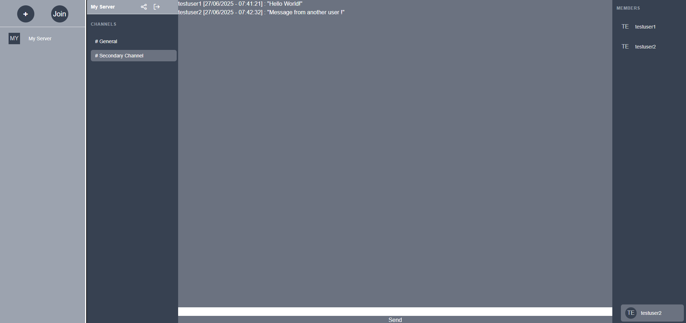

# EchoPulse - Distributed Discord Clone

**EchoPulse** is a distributed minimalist clone of Discord designed as a backend technical demonstrator.

## Disclaimer

The sole purpose of this project is to:

- practice **hexagonal architecture** and clear separation of concerns,
- work with **Kafka** in a distributed context.

No attention has been paid to industrialization, advanced security, or test coverage.

## Front-End Disclaimer

The front-end is intentionally minimal and only serves to illustrate client-side features:
The core of the project lies entirely in the **distributed backend infrastructure**.

---

## Build & Run

### Pre-requisites 

The following ports are needed :

| Host Port | Related Service       | Description                              |
| --------- | --------------------- |------------------------------------------|
| `8181`    | echopulse-chat        | server port for the chat service         |
| `8282`    | echopulse-server      | server port for the server service       |
| `18080`   | keycloak-service      | Keycloak                                 |
| `9000`    | kafdrop               | Kafdrop web UI (Not necessary for usage) |
| `9092`    | kafka                 | Kafka listener exposed to the host       |
| `29092`   | kafka                 | Kafka internal listener                  |
| `2181`    | zookeeper             | Zookeeper default port                   |
| `5432`    | server-service-db     | PostgreSQL for the server service        |
| `5433`    | keycloak-service-db   | PostgreSQL for Keycloak                  |
| `6379`    | chat-service-redis-db | Redis used by the chat service           |

### Build **core**

The project **core** contains the business logic for both **server** and **chat** microservices and must be built first.
The easiest way to do this would be to install it in maven's dependency tree with the following command :
````
    mvn clean install
````

### Buid services and run keycloak as container

Both **chat** and **server** require being able to send requests to keycloak (for authorization purposes).
It is easier to run the services locally and run keycloak as a container.
To run the services locally, the following command must be executed in each project :

````
    mvn clean spring-boot:run
````

## Build services as images

Both **chat** and **server** services have the spring boot maven plugin their pom.xml files.
To build their images, the following command must be executed in each project :
````
    mvn clean spring-boot:build-image
````
The images resulting from this have the following names :
- echopulse-server
- echopulse-chat

An example docker compose file :
````
  echopulse-server:
    container_name: echopulse-server
    image: echopulse-server:1.0.0-SNAPSHOT
    ports:
      - "8282:8282"
    depends_on:
      - keycloak-service
      - kafka
      - server-service-db
    environment:
      SPRING_DATASOURCE_URL: jdbc:postgresql://server-service-db:5432/serverdb
      SPRING_KAFKA_BOOTSTRAP_SERVERS: "localhost:29092"
      SPRING_SECURITY_OAUTH2_RESOURCESERVER_JWT_JWK_SET_URI: http://localhost:18080/realms/echopulse
      LOGGING_LEVEL_ORG_SPRINGFRAMEWORK_SECURITY: DEBUG
  echopulse-chat:
    container_name: echopulse-chat
    image: echopulse-chat:1.0.0-SNAPSHOT
    ports:
      - "8181:8181"
    depends_on:
      - keycloak-service
      - kafka
      - chat-service-redis-db
    environment:
      SPRING_DATASOURCE_URL: jdbc:postgresql://chat-service-redis-db:5432/serverdb
      SPRING_KAFKA_BOOTSTRAP_SERVERS: "localhost:29092"
      SPRING_SECURITY_OAUTH2_RESOURCESERVER_JWT_ISSUER_URI: http://localhost:18080/realms/echopulse
````

### Run docker compose

Since the docker images for the services have been built, you can run the docker compose file in the folder **docker** with the following command
````
    docker compose run -d
````

### Create keycloak realm

Usin keycloak's UI (**http://localhost:18080**) and the configuration files provided in **keycloak-exports**, create the realm and the clients.

### Run the front-end

Since the front-end is purely for demonstration purposes, you can simply run it locally by executing the following command in the folder **echo-pulse-front**:
````
    npm install
    npm start
````

### Create a keycloak user

Using keycloak's UI (**http://localhost:18080**) create a user with a password.


The environment is now up and running, you can access the app using **http://localhost:4200**.

### Kafdrop

Kafdrop is also provided in the docker compose and available at **http://localhost:9000** after running the docker compose file.

---

## Preview



---

## Architecture

EchoPulse is built on an **event-driven hexagonal microservices architecture**, designed to demonstrate the implementation of a **real-time distributed system** using **Kafka**.  
The frontend consumes REST APIs and connects via WebSocket.

---

### Services

#### 1. Server Service

- Creation and management of servers, channels, and memberships
- Kafka event publishing
- Persistence: PostgreSQL
- Communication: REST + Kafka (producer)

#### 2. Chat Service

- Kafka event consumption (channels, messages, users)
- WebSocket STOMP broadcasting
- Volatile message storage in Redis
- Communication: WebSocket + REST (message retrieval)

---

### Authentication

- Provided by Keycloak (OIDC)
- JWT decoded and validated for every request (REST and WebSocket)
- WebSocket authentication integrated in the handshake and STOMP interceptors

---

### Hexagonal Design

- `core/`: pure business logic, framework-independent
- `port in`: interfaces for use cases (input commands)
- `port out`: interfaces for external dependencies (Kafka, Redis, WebSocket)
- `adapters/`: concrete implementations (Kafka producer, WebSocket handler, etc.)

---

### Kafka Events

| Event                  | Sender  | Receiver |
|------------------------|---------|----------|
| channels.create        | server  | chat     |
| channels.delete        | server  | chat     |
| user.join-server       | server  | chat     |
| user.leave-server      | server  | chat     |
| channels.send-message  | chat    | chat     |

---

## Technical Stack

| Domain         | Tools                        |
|----------------|------------------------------|
| Language       | Java 17                      |
| Framework      | Spring Boot 3                |
| Messaging      | Apache Kafka                 |
| Databases      | PostgreSQL (server), Redis (chat) |
| Authentication | Keycloak + Spring Security OAuth2 |
| WebSocket      | STOMP via Spring Messaging   |
| Containers     | Docker + Docker Compose      |
| Architecture   | Modular hexagonal architecture |

---

## Limitations and Areas for Improvement

- No Automated tests across microservices
- No Monitoring, structured logging, distributed tracing
- Durable message persistence not implemented
- No swagger
